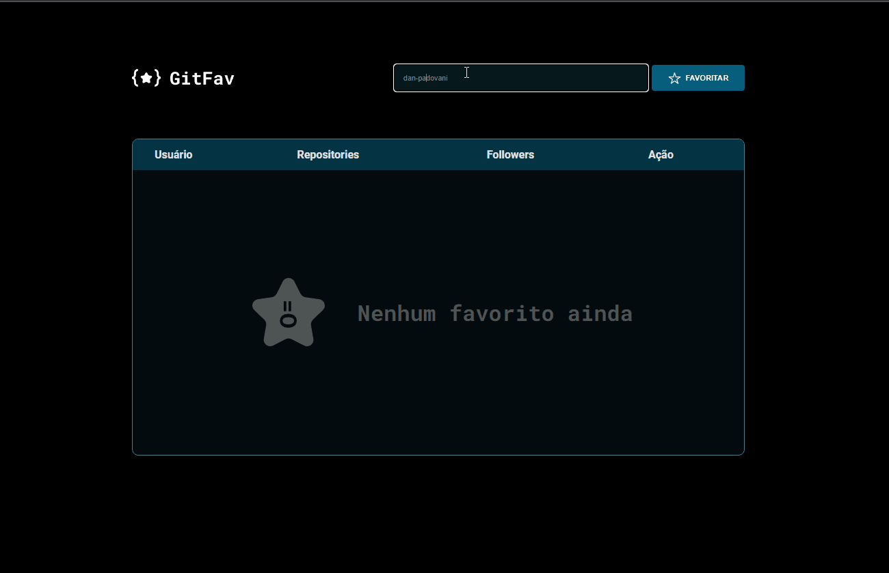
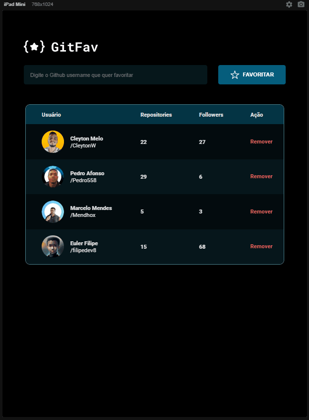
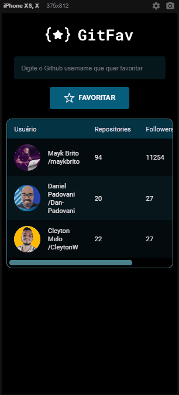

# Explorer_projeto08_GitFav

## GitFav - An Aplication to save our favorite users of github

	<a href="#computer-about">About</a> •
 	<a href="#art-layout">Layout</a> • 
 	<a href="#clipboard-how-to-use">How to use</a> • 
 	<a href="#rocket-technologies">Tech Stack</a> • 
 	<a href="#dart-author">Autor</a> • 
 	<a href="#memo-license">License</a>

### :computer: About

In this challenge, it was requested to create an application to save our favorite github users.  
Using the github API to search, we can add or remove our users
The page saves this information in local storage of browser.

I had the oportunity to practice and study:
* Constructor Classes;
* Promisses with Async Await;
* Try, catch and throw;
* Github API;
* Immutability in Functional Programming;
* Using local storage;
* Using fetch() and .then() - as a basic API;
*	Callbacks functions;
* Work with HTML tables;
*	ES6 Modules.

---

### :art: Layout

### Desktop

	

### Tablet and Mobile

	
	 
	

---

### :clipboard: How To Use

Just access the link bellow. 

<a href="https://danp/" target="_blank">GitFav</a>

---

### :rocket: Technologies

---

### :dart: Author

	Made with &#128150 by Daniel Padovani &#128075 Entre em contato! 	

    

---

### :memo: License

This project is under the MIT license. See the [LICENSE](LICENSE) for more information.

